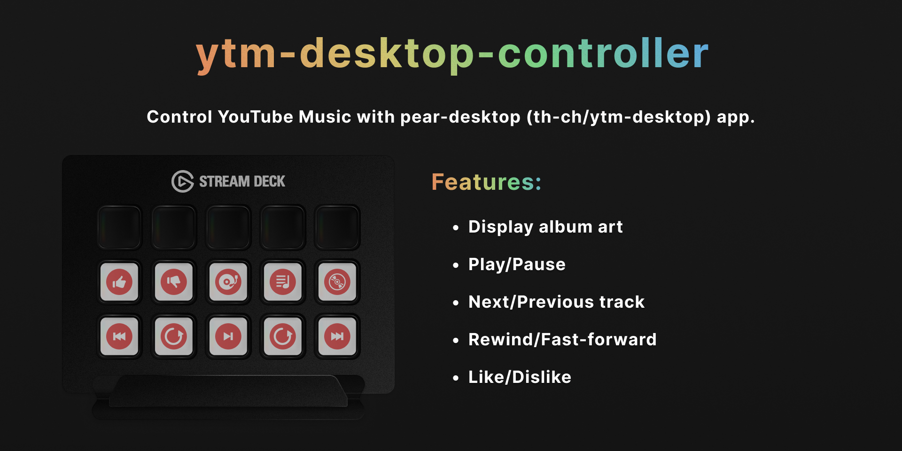

# ytm-desktop controller

This streamdeck plugin allows you to control YouTube Music with [pear-desktop](https://github.com/pear-devs/pear-desktop) (previous name: th-ch/ytm-desktop). 

## Setup
1. Install [pear-desktop](https://github.com/pear-devs/pear-desktop)  
    Please refer [pear-desktop installation guide](https://github.com/pear-devs/pear-desktop?tab=readme-ov-file#download).
2. Set API Plugin on pear-desktop
    Please click `Plugins -> API Server [beta]`, then, set `Plugins -> API Server [beta] -> Authorization strategy -> No authorization`.  
    Note: Default port number of API is set to `26538` (you can check it in `Plugins -> API Server [beta] -> Port`). 

3. Install Streamdeck Plugin [here]()

## Features
- [Base Arguments](#base-arguments)
- [Add Playlist to Queue](#add-playlist-to-queue)
- [Add Track to Queue](#add-track-to-queue)
- [Artwork](#artwork)
- [Go Forward](#go-forward)
- [Go Back](#go-back)
- [Toggle Play](#toggle-play)
- [Next](#next)
- [Previous](#previous)
- [Like](#like)
- [Dislike](#dislike)

---
  
### Base Arguments
- `Port`: port number of the API. Default is `26538`.
- `Show Now-playing Artwork`: Show artwork if play. This option will save when the streamdeck is restarted. Please restart or page switch to apply the setting. 

### Add Playlist to Queue
Add a YouTube Music playlist to the queue. 
> [!NOTE]
> The playlist that you want to play must be shared as `Public` or `Unlisted`. 

| Argument | Description |
|---|---|
| `Playlist Id` | The ID of the playlist. If the shared link is `https://music.youtube.com/playlist?list=abcde`, `Playlist Id` is `abcde`. |
| `Force Play` | Skip the current queue and play. |
| `Shuffle` | Shuffle the playlist before adding to the queue. |

### Add Track to Queue
Add a YouTube Music track to the queue. 

| Argument | Description |
|---|---|
| `videoId` | The ID of the video. If the music link is `https://music.youtube.com/watch?v=abcde&...`, `videoId` is `abcde`.|
| `forcePlay` | Skip the current queue and play. |

### Artwork
Displays the album art of the currently playing song.

### Go Forward
Fast-forward the currently playing song. 

| Argument | Description |
|---|---|
| `time` | The number of seconds to fast-forward. |

### Go Back
Rewind the currently playing song.

| Argument | Description |
|---|---|
| `time` | The number of seconds to rewind. |

### Toggle Play
Toggle play/pause. 

### Next
Skip to the next track.

### Previous
Skip to the previous track.

### Like
Like the currently playing song. 

### Dislike
Dislike the currently playing song. 